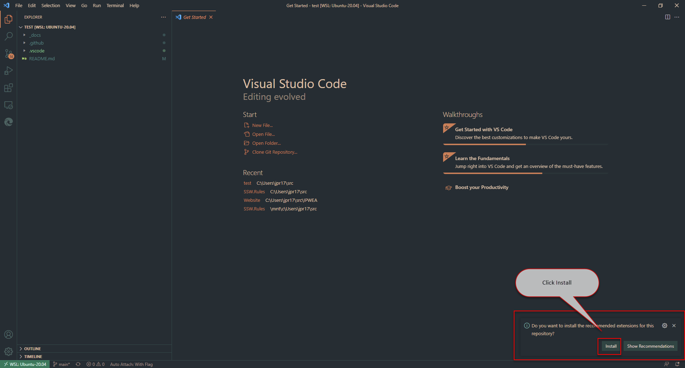

# SSW.Rules

 

This is a Gatsby generated site pulling data from:
- [SSW Rules Content Repo 📜](https://github.com/SSWConsulting/SSW.Rules.Content)

## Getting Started

### Required Tools
- Install nodejs version specified in `.nvmrc` (Ideally use `nvm` to use the right version)
- Ensure corepack is enabled - `corepack enable` (this allows auto-install of the correct `yarn` version)

### Getting ready for development
- Clone the repo from https://github.com/SSWConsulting/SSW.Rules
- Run `yarn install` to install packages
- Create environment files `.env.development` based off `.env.template` - get the values from Keeper (SSW.Rules Environment Variables)
- For `GITHUB_API_PAT`, create a [PAT on GitHub](https://docs.github.com/en/enterprise-server@3.4/authentication/keeping-your-account-and-data-secure/creating-a-personal-access-token)
- Set `CONTENT_BRANCH` to `small-content` (it's a smaller version of the main content branch which will build much quicker 🙂)

> **Notes:**  
> * If you don't work at SSW or can't get on to the SSW.Rules team you can just add values to GITHUB_API_PAT and CONTENT_BRANCH  
> * Sometimes you might want to use `main` or create your own branch if you are testing something.

### Development
1. Branch off main for your PBI
2. Install the recommended extensions if using VS Code
3. Do your work
4. Run the site in development mode by `yarn dev` (.env.development is required for this step) it takes a while to build all the rules    
   If you have issues, run `yarn clean` then `yarn dev`
5. Commit code and push
6. Raise a PR
7. Get it merged!

**Figure: VS Code recommended extensions notification**

### Definition of Done

- Code Compiles
- Check the Acceptance Criteria.
- Code is squash-merged to main via a pull request that was approved by a 2nd developer.
- Another team member agrees it’s ready for Production.
- Pushed to Production.
- Use @Mention (**OR** Send email) to notify Product Owner/PBI stakeholder that PBI is done (be sure to include screenshots/done video as proof) 

As per rule: [Done - Do you go beyond 'Done' and follow a 'Definition of Done'?](https://www.ssw.com.au/rules/done-do-you-go-beyond-done-and-follow-a-definition-of-done)

### Branches
- Branching strategy is based off [Release Flow](https://docs.microsoft.com/en-us/azure/devops/learn/devops-at-microsoft/release-flow) 
- `main` is the main 'dev' branch
- `release/xx` is the 'production' one (where xx is the Sprint number)
- Always create a new branch for your PBIs 
- Always delete your branch once your PR has been merged

### Builds
- Changes made to http://github.com/SSWConsulting/SSW.Rules.Content (i.e. rule changes) trigger builds that deploy:
  - **Main** to the **Staging** - check the [latest staging workflow](https://github.com/SSWConsulting/SSW.Rules/deployments/staging) for the URL
  - latest **release/xx** to the **Production** site: [ssw.com.au/rules](https://www.ssw.com.au/rules)
  
- Branching off **main** to **release/xx**, or making changes to **release/xx** will build and deploy to the **Production** site: [ssw.com.au/rules](https://www.ssw.com.au/rules)

### GitHub Actions Documentation

📘 Documentation for how GitHub Actions are used in this project is available in the [Wiki](https://github.com/SSWConsulting/SSW.Rules/wiki).

### Rules repository

> Rules repository lives here: https://github.com/SSWConsulting/SSW.Rules.Content

Merging changes to **main** on this repo will trigger:
- a build/release of the **main** branch in Staging - check the [latest staging workflow](https://github.com/SSWConsulting/SSW.Rules/deployments/staging) for the url
- a build/release of the **release** branch Production - [ssw.com.au/rules](https://www.ssw.com.au/rules)

### Example rule
- An example rule is provided in the repo under `http://localhost:{{ PORT NUMBER }}/rule/`
- This example rules shows all the different components that can be used e.g. headings, lists, boxes, etc.

**Figure: Sample of the Example Rule**

### Updating and Syncing a Rule from Rules.Content

Sometimes you might have to update a rule markdown file to test your latest feature, such as changing the background color of a greybox.

To update specific markdown components, follow these steps:

1. Access the `small-content` branch:
   - Visit [SSW.Rules.Content](https://github.com/SSWConsulting/SSW.Rules.Content)
   - Switch to the `small-content` branch
2. Edit the Rule:
   - Locate the rule you want to modify in the `small-content` branch
3. Test Your Changes Locally:
   - Open your local instance of SSW.Rules, usually in VS Code
   - Build the project using the following commands: `yarn clean` and then `yarn dev`
   - Open your local instance in your browser and navigate to the edited rule to see your changes

### Gatsby Build Timeout

The Gatsby build step in GitHub Actions has a 30-minute timeout to prevent it from running indefinitely. This is due to intermittent issues with external dependencies.

For more details on the Gatsby build issue, refer to the [Gatsby issue](https://github.com/gatsbyjs/gatsby/issues/38989).
