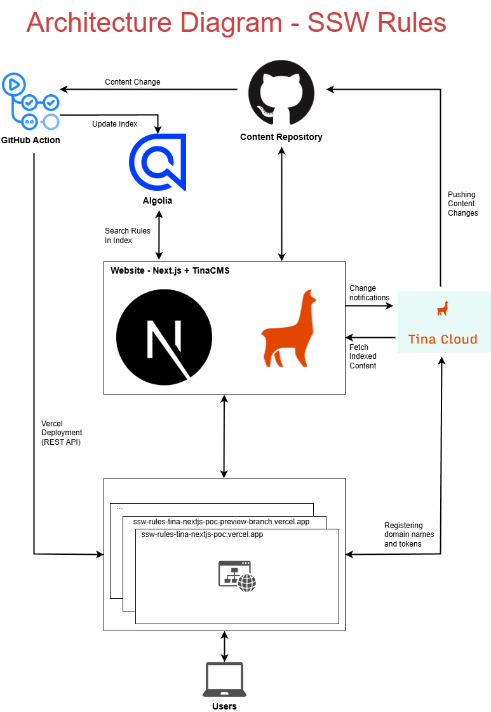

# SSW.Rules.Tina.Nextjs.POC

[](https://gitmoji.dev) [](https://github.com/SSWConsulting/SSW.Rules.Tina.Nextjs.POC/actions/workflows/codeauditor-test.yml)

A POC that will validate the compatibility between Rules and Tina – using Next.js.  

The site pulls data from [SSW Rules Content Repo 📜](https://github.com/SSWConsulting/SSW.Rules.Content)
## Architecture Diagram




## Getting Started

### Required Tools
- Node.js (version defined in .nvmrc) – recommended to use nvm
- [corepack](https://github.com/nodejs/corepack) (run corepack enable to manage correct pnpm version)
- [pnpm](https://pnpm.io/installation) package manager


### F5 experience

1. Clone this repo

2. Clone [SSW.Rules.Content](https://github.com/SSWConsulting/SSW.Rules.content) and switch to the `tina/migration-dev-content` branch

3. Place both repos in the same parent directory e.g.
```
📁 SSW.Rules/
├── 📁 SSW.Rules.Content/
└── 📁 SSW.Rules.Tina.Nextjs.POC/
```

4. Create a `.env` file based off `.env.example` in the root of this repo - get the values from Keeper (SSW.Rules.PoC Environment Variables)

5. Run `pnpm install` to install packages

6. Run `pnpm dev` to start the development server


### Syncing and Updating Content
To test changes to MDX rules:

1. Go to the `tina/migration-dev-content` branch of SSW.Rules.Content

2. Modify the rule MDX as needed

3. Run `pnpm dev` in this project to see the changes reflected locally

### Branches
- Always create a new branch for your PBIs 
- Always delete your branch once your PR has been merged
- To create a new **content branch** (in `SSW.Rules.Content`), follow the setup steps in the [Wiki](https://github.com/SSWConsulting/SSW.Rules.Content/wiki/How-to-Recreate-the-tina-main-Branch-(If-Deleted))
  

## Builds & Deployment

### SSW.Rules.Tina.Nextjs.POC
- Changes made to [SSW.Rules.Tina.Nextjs.POC]() trigger builds that deploy to Azure

### SSW.Rules.Content
- Changes made to [SSW.Rules.Content](http://github.com/SSWConsulting/SSW.Rules.Content) (i.e. rule changes) trigger builds that deploy:
  - **main** to the **staging** - https://ssw-rules-tina-staging-c5bwbjc4a8d2g8gm.australiaeast-01.azurewebsites.net/
  - latest **release/xx** to the **production** site - https://www.ssw.com.au/rules-beta/


## POC Progress Checklist

- [x] Content editing UI working with Tina
- [x] Deployment pipeline for PoC website
- [x] Migration scripts for rule content (Markdown → MDX)
- [x] Rule-to-category JSON generation
- [x] Category URI-title mapping
- [x] Automated content processing via GitHub Actions
- [x] Media content management
- [x] Basic component creation (e.g. Email, YouTube)
- [x] Algolia search integration
- [x] Editorial workflow enabled
- [x] Vercel deployment setup
- [x] Azure deployment setup
- [x] Full deployment with all rules
- [x] Migration script all rules md to mdx
- [ ] Preview deployment on Azure


---

### Python Scripts

#### In the PoC Repository

- **`build-rule-category-map.py`**  
  Generates two JSON files:
  - `rule-to-categories.json` (maps rules to categories)  
  - `category-uri-title-map.json` (maps category URIs to titles)  
  Reads rule data from the `SSW.Rules.Content` repo and runs during the build process (via GitHub Actions) or manually from `scripts/tina-migration`.

- **`prepare-content.js`**  
  A Node.js script that runs `build-rule-category-map.py` and moves the JSON files to the correct location for use by the website.  
  Uses the `LOCAL_CONTENT_RELATIVE_PATH` environment variable to locate the content repo.

#### In the Content Repository

- **`build-rule-category-map.py`**  
  Similar logic to the version in PoC. It processes the `categories/` folder and `.mdx` files to create the same JSON maps.

- **`convert-rule-md-to-mdx.py`**  
  Converts `.md` rule files to MDX format compatible with TinaCMS.  
  Replaces custom markdown patterns (e.g., `Figure`, `good/bad/ok` boxes) with structured MDX components like `<asideEmbed>` and escapes special characters for valid formatting.

- **`modify-sub-categories-frontmatter.py`**  
  Updates frontmatter in sub-category files (excluding `index.md`) to ensure consistency.

- **`modify-top-categories-frontmatter.py`**  
  Targets `index.md` files in sub-category folders and updates frontmatter to match the expected format.

---

### 📁 Public Content Folder

**We moved all rule content (including .mdx files and images) into the public/ folder. Check this PBI for more details: [Media - Implement Media Management Option C](https://github.com/SSWConsulting/SSW.Rules/issues/1775)**

```
public/
└── uploads/
    └── rules/
        ├── rule-a/
        │   ├── rule.mdx
        │   └── img.png
        └── rule-b/
            ├── rule.mdx
            └── img.png
```
🎥 [The 3 options for storing markdown in GitHub for TinaCMS](https://www.youtube.com/watch?v=JX90jbgAvRw&t=7s)
---


### 📝 Adding Editorial Workflow
We've integrated TinaCMS with an editorial workflow to support content editing in a more structured way. If you're unfamiliar with how editorial workflows work in Tina, please refer to the official documentation:

👉 [TinaCMS Editorial Workflow Documentation](https://tina.io/docs/tina-cloud/editorial-workflow)

This workflow allows for content changes to be reviewed before being published, improving collaboration and content quality.


### 🔖 Bookmarks (via SSW.Rules.Functions)

The Bookmark feature uses the **[SSW.Rules.Functions](https://github.com/SSWConsulting/SSW.Rules.Functions)** API.

**Local debugging setup**
1. Clone the `SSW.Rules.Functions` repository.
2. In the repo root, create a `local.settings.json` file and copy the values from Keeper (environment variables for the Functions app).
3. Start the Functions app in **dev** mode.

**Local endpoint**
- By default, the API is available at: `http://localhost:7248`.
- Bookmark data is persisted to the **staging** database.

