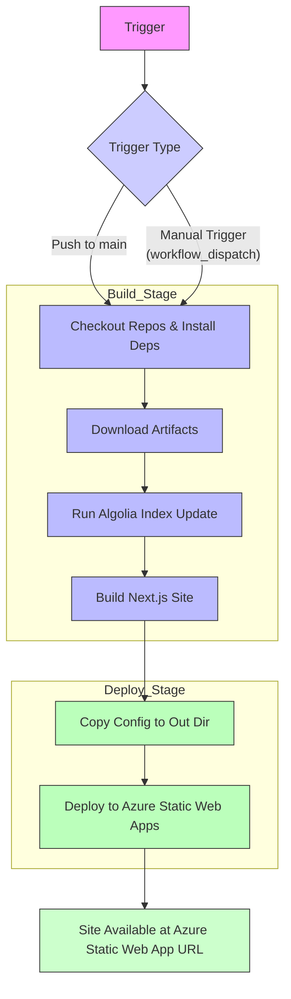

# Build and Deploy
This GitHub Action builds and deploys the production version of **SSW.Rules** using **Next.js** and **Azure Static Web Apps**.

## Workflow Overview

### When It Runs

- **On push** to the `main` branch – automatic deployments for published content.
- **Manually**, using the **"Run workflow"** button in GitHub:
  - Requires input:
    - `run_id` – The workflow run ID of the content pipeline
    - `branch_name` – The source content branch to build against

### Build Stage

#### 1. Checkout Repositories & Install Dependencies

#### 2. Download Artifacts

Downloads content artifacts from another workflow run:

- `rule-to-categories.json`
- `category-uri-title-map.json`

These files are saved into the appropriate location under `website/`.

#### 3. Run Algolia Index Update

- Executes `scripts/update_algolia_index.js`
- Pushes updated rule content into Algolia

#### 4. Build the Next.js Site

- Runs `pnpm build` inside `website/`
- Uses TinaCMS branch info and token
- Output is placed in `website/out/`

### Deploy Stage

#### 1. Copy Static Web App Config

- Moves `staticwebapp.config.json` to the build output directory (`website/out`)

#### 2. Deploy to Azure Static Web Apps

- Uses the `Azure/static-web-apps-deploy@v1` action
- Uploads `website/out` to Azure
- Skips redundant app and API builds

### Inputs

#### Inputs (for `workflow_dispatch`)

- `run_id`: ID of the source content workflow (required)
- `branch_name`: Branch of the content repo (required)

### Notes

- **Concurrency**: Uses `concurrency: group: pages` to prevent overlapping deploys.
- **Artifacts**: JSON files (`rule-to-categories.json`, `category-uri-title-map.json`) are pulled from previous workflow runs using GitHub CLI.
- **Flexibility**: Manual trigger allows you to test or redeploy specific branches/content versions.
